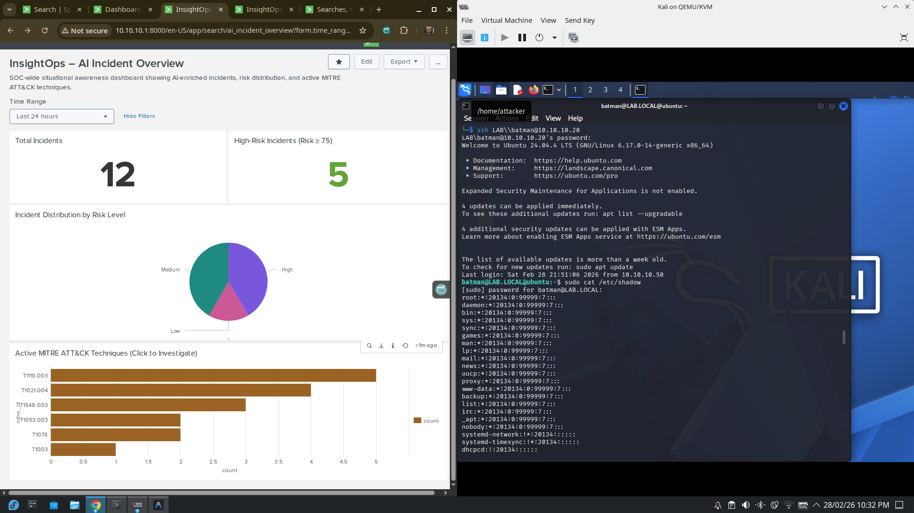
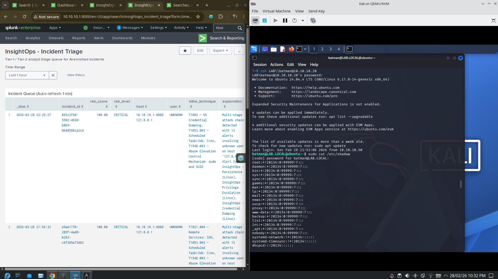
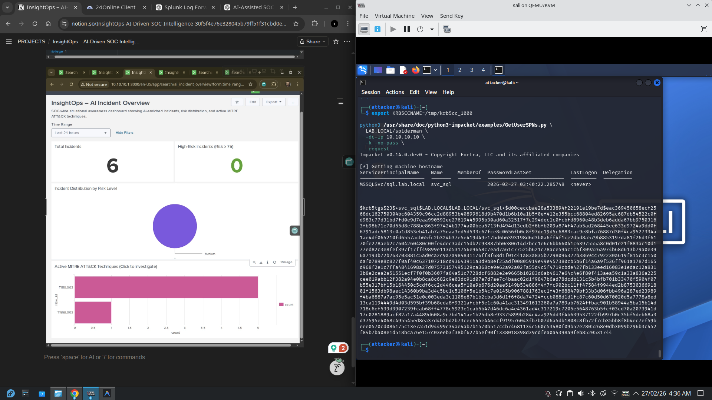
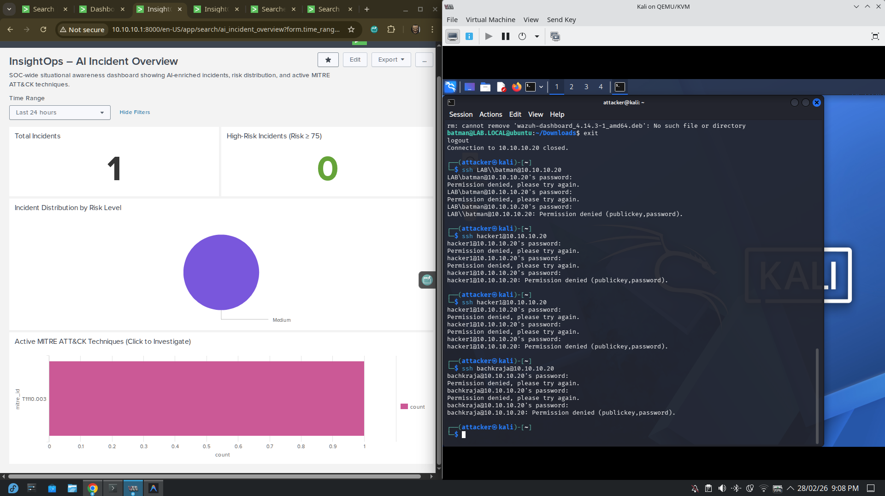

<div align="center">

# ⚡ InsightOps

### AI-Driven SOC Intelligence Engine

[](https://python.org)
[](tests/)
[](web/server.py)
[](https://attack.mitre.org)
[](LICENSE)

**InsightOps correlates security alerts, assigns deterministic risk scores, maps MITRE ATT&CK techniques, and generates analyst-ready incident narratives — without ML, black boxes, or automated response.**

[🌐 Live Dashboard](#-interactive-web-dashboard) · [🚀 Quick Start](#-quick-start) · [🏗️ Architecture](#%EF%B8%8F-architecture) · [📖 Documentation](#-project-structure)

</div>

---

## 🎯 What Is InsightOps?

InsightOps is an **enterprise-grade, SOC-assist intelligence platform** built to mirror real-world Security Operations Center workflows — not academic simulations.

Most student projects stop at log ingestion or isolated detections. InsightOps implements a **full detection-to-incident pipeline**:

| Capability | Description |
|---|---|
| 🔍 **Detection Engineering** | 11 MITRE ATT&CK–aligned alerts (SPL) covering Windows + Linux |
| 🧠 **AI Intelligence Engine** | Deterministic risk scoring, multi-stage correlation, explainability |
| 📊 **Splunk Integration** | Pulls alerts via REST API, writes enriched incidents back via HEC |
| 🩺 **Signal Health Check** | Pre-pipeline telemetry freshness verification |
| 🌐 **Live Web Dashboard** | SSE-powered terminal, architecture visualizer, pipeline execution |
| 🧪 **77 Unit Tests** | Full coverage — no Splunk connection required |

> **SOC-Assist, not SOC-Automation.** InsightOps augments human analysts by prioritizing, correlating, and explaining security signals. It never performs automated response, preserving analyst decision integrity.

---

## 🏗️ Architecture

InsightOps follows a **three-layer SOC architecture**:

```
┌─────────────────────────────────────────────────┐
│  Layer 1 — SOC Infrastructure                   │
│  Fedora Host · DC01 (Win Server 2019) · Win10   │
│  Ubuntu · Kali (Attacker) · Splunk Enterprise   │
│  Centralized log collection · AD Domain         │
└─────────────────────┬───────────────────────────┘
                      │ REST API :8089
┌─────────────────────▼───────────────────────────┐
│  Layer 2 — AI Intelligence Engine (Core)        │
│                                                 │
│  [0] Signal Health Check  signal_health.py      │
│  [1] Fetch Alerts    ←    splunk_client.py      │
│  [2] Risk Scoring    ←    risk_scorer.py        │
│  [3] Correlation     ←    incident_builder.py   │
│  [4] Bonus Engine    ←    bonus_engine.py       │
│  [5] Explainability  ←    explainer.py          │
│  [6] Write to HEC    ←    hec_writer.py         │
└─────────────────────┬───────────────────────────┘
                      │ HEC :8088
┌─────────────────────▼───────────────────────────┐
│  Layer 3 — Enriched Intelligence (ai_soc index) │
│  Analyst Triage Queue · SOC Overview Dashboard  │
└─────────────────────────────────────────────────┘
```

---

## 🌐 Interactive Web Dashboard

InsightOps ships with a live web dashboard that connects directly to the AI engine:

- **Live terminal** — stream dry-run or full pipeline output in real time via SSE
- **Architecture visualizer** — pipeline steps light up as they execute
- **Run Tests** — trigger the pytest suite and watch results stream in
- **Download Log** — export the full terminal output as `.txt`
- **Fallback simulation** — plays an animated dry-run if the Flask server isn't running

```bash
# Install Flask (one-time)
pip install flask

# Start the server from project root
python web/server.py

# Open in browser
open http://localhost:5000
```

---

## 🚀 Quick Start

### 1. Clone & Install

```bash
git clone https://github.com/Nikhil0905/InsightOps.git
cd InsightOps
pip install -r requirements.txt
pip install flask  # for the web dashboard
```

### 2. Configure Credentials

```bash
cp .env.example .env
# Fill in your values:
#   SPLUNK_USERNAME=...
#   SPLUNK_PASSWORD=...
#   SPLUNK_HEC_TOKEN=...
source .env
```

### 3. Configure Connection

Edit `config/splunk.yaml`:
```yaml
splunk_host: 10.10.10.1
management_port: 8089
hec_port: 8088
ai_soc_index: ai_soc
```

### 4. Run

```bash
# Dry-run (safe — no writes to Splunk)
python ai-engine/main.py --dry-run

# Full pipeline
python ai-engine/main.py

# Run all tests (no Splunk needed)
pytest tests/ -v
```

**Expected dry-run output:**
```
INFO  Dry run enabled: no data will be sent to Splunk
--- Signal Health Check ---
[OK] linux_secure: last event 2 minutes ago
⚠️  wineventlog:security: no events in last 12 minutes
[OK] alert:InsightOps*: last event 1 minute ago
---------------------------
INFO  Fetching alerts from Splunk
INFO  Scored 4 alerts
INFO  Correlating incidents
INFO  [DRY-RUN] Would write incident af3c89d1 to Splunk HEC
INFO  [DRY-RUN] Would write incident b7e21a4f to Splunk HEC
INFO  Pipeline completed
```

---

## 🔍 Detection Coverage

11 detections across Windows and Linux, all mapped to MITRE ATT&CK:

| Alert | Platform | MITRE | Severity |
|---|---|---|:---:|
| Password Spraying | Windows / Linux | T1110.003 | `HIGH` |
| SSH Brute Force | Linux | T1110.001 | `LOW` |
| Kerberoasting | Windows | T1558.003 | `CRITICAL` |
| Lateral Movement (WMI/SMB) | Windows | T1021 | `HIGH` |
| Lateral Movement (SSH fan-out) | Linux | T1021.004 | `HIGH` |
| Privilege Escalation | Windows | T1068 | `CRITICAL` |
| Privilege Escalation (sudo/SUID) | Linux | T1548.003 | `CRITICAL` |
| Persistence (Registry/Task) | Windows | T1547 | `CRITICAL` |
| Persistence (cron) | Linux | T1053.003 | `CRITICAL` |
| Credential Dumping | Windows / Linux | T1003 | `CRITICAL` |
| Ransomware Pre-Impact | Windows / Linux | T1490 | `CRITICAL` |

> Raw SPL for all alerts lives in [`splunk/detections/savedsearches.conf`](splunk/detections/savedsearches.conf)

---

## 📊 Risk Scoring

Each alert is scored across 4 factors, then incidents receive correlation bonuses:

```
risk_score = normalize(
    severity         × w_base_severity       +
    host_criticality × w_host_criticality    +
    user_privilege   × w_user_privilege      +
    event_frequency  × w_behavioral_frequency
) + correlation_bonus   →   capped at 100
```

**Default weights** (`config/weights.yaml`):

| Factor | Weight |
|---|---|
| Base Severity | 1.0 |
| Host Criticality | 1.0 |
| User Privilege | 1.0 |
| Behavioral Frequency | 1.0 |
| Correlation Bonus (base) | 15.0 |

### Multi-Stage Correlation Bonuses

| Attack Chain | Bonus |
|---|---|
| Any Password Spraying detected | +0.5× |
| PS → Kerberoasting | +1× |
| Credential Access → Privilege Escalation | +1× |
| Priv-Esc → Persistence | +1× |
| Linux Lateral Movement (SSH fan-out) | +1× (amplified if cred access present) |
| Any Credential Dumping | +1× |
| Pre-Ransomware after PE / Persistence / LM | **Capped at 100 (CRITICAL)** |

---

## 🧠 Explainability Output

Every incident written to Splunk contains a fully human-readable enriched JSON:

```json
{
  "incident_id": "af3c89d1-...",
  "risk_score": 87.5,
  "plain_english_summary": "A 3-alert chain on dc01 indicates credential theft and privilege escalation...",
  "mitre_techniques": [
    {"technique_id": "T1110.003", "technique_name": "Brute Force: Password Spraying"},
    {"technique_id": "T1558.003", "technique_name": "Steal or Forge Kerberos Tickets"},
    {"technique_id": "T1068",     "technique_name": "Exploitation for Privilege Escalation"}
  ],
  "risk_score_explanation": "Score elevated by multi-stage chain correlation bonus of +30.0...",
  "investigation_steps": [
    "Review failed authentication events on dc01 for the time range...",
    "Check for suspicious Kerberos ticket requests in Windows Security logs...",
    "Investigate privilege escalation indicators on the affected host..."
  ]
}
```

---

## 🩺 Signal Health Check

Runs automatically before every pipeline execution. Queries Splunk for the freshness of:

| Signal | Splunk Filter |
|---|---|
| `linux_secure` | `sourcetype=linux_secure` |
| `wineventlog:security` | `sourcetype=wineventlog:security` |
| `alert:InsightOps*` | `source="alert:InsightOps*"` |

Warns if any signal has no events in the last 10 minutes. Fully fail-safe — never blocks the pipeline even if Splunk is unreachable.

---

## 🧪 Tests

```bash
pytest tests/ -v
# 77 passed in 0.17s ✓
```

All 77 tests run **offline** — no Splunk connection required.

| Test File | What's Covered |
|---|---|
| `test_risk_scorer.py` | Scoring formula, caps, breakdown keys |
| `test_bonus_engine.py` | All bonus rules, stacking, ransomware cap |
| `test_incident_builder.py` | Alert grouping, time windows, schema |
| `test_explainer.py` | MITRE classification, investigation steps |
| `test_splunk_client.py` | All 11 alert classifiers, user/host field extraction |

---

## 📁 Project Structure

```
InsightOps/
├── web/
│   ├── index.html          Landing page + live terminal UI
│   ├── style.css           Dark glassmorphism design system
│   ├── script.js           SSE client + pipeline visualizer + fallback sim
│   └── server.py           Flask backend — SSE streaming + gallery routes
│
├── ai-engine/
│   ├── main.py             Pipeline orchestrator (6-stage flow)
│   ├── scoring/
│   │   └── risk_scorer.py  4-factor weighted risk scoring (0–100)
│   ├── correlation/
│   │   ├── incident_builder.py   Alert → incident grouping
│   │   └── bonus_engine.py       Multi-stage chain bonuses
│   ├── explainability/
│   │   └── explainer.py    MITRE mapping, summaries, investigation steps
│   ├── health/
│   │   └── signal_health.py      Telemetry freshness check
│   └── ingestion/
│       ├── splunk_client.py      Alert fetch + classification
│       └── hec_writer.py         Write enriched incidents to Splunk HEC
│
├── tests/                  77 unit tests (pytest), fully offline
├── config/
│   ├── splunk.yaml         Connection config (no credentials)
│   └── weights.yaml        Scoring weights
├── splunk/
│   └── detections/
│       └── savedsearches.conf    Raw SPL for all 11 detections
├── docs/
│   ├── Images_Proof/       Live attack simulation screenshots
│   ├── Lessons_Learned.md  15 lessons from building the project
│   └── DASHBOARDS.md       Splunk dashboard XML definitions
├── .env.example            Credential template
├── requirements.txt
└── pytest.ini
```

---

## 📸 Screenshots

### Multi-Stage Attack Correlation — Incident Triage Queue
> AI-correlated incidents showing deterministic risk capping at 100 (CRITICAL) for multi-stage chains.




### Live Simulation: Kerberoasting vs SOC Overview
> Attacker executing `GetUserSPNs.py` against Active Directory while the AI engine correlated alerts in real time.



### Live Simulation: SSH Password Spraying
> Credential spraying against Ubuntu host; AI engine mapped behavior to T1110.003 and escalated risk score.



---

## 🌐 Lab Network Design

| Component | IP |
|---|---|
| Fedora Host (Splunk + AI Engine) | `10.10.10.1` |
| DC01 — Windows Server 2019 (AD) | `10.10.10.10` |
| Ubuntu Domain Client | `10.10.10.20` |
| Windows 10 Domain Client | `10.10.10.30` |
| Kali Linux (Internal Attacker) | `10.10.10.50` |

- Internal SOC LAN: `10.10.10.0/24`
- NAT / Internet: `192.168.122.0/24`
- Dual-NIC architecture for realistic east–west traffic simulation

---

## 🎓 Academic Context

Built as a **6th-semester B.Tech (CSE — Cybersecurity)** portfolio project at a production SOC engineering level — real SIEM integration, Windows + Linux kill-chain coverage, and an explainability-first design philosophy that goes well beyond typical academic scope.

**Target roles demonstrated:**
SOC Analyst (Tier 1/2) · Blue Team Engineer · Detection Engineer · SIEM/SOC Automation Engineer · Entry-level DFIR

---

<div align="center">

*InsightOps is not a tool that "detects attacks." It is a system that **protects analyst decision integrity.***

</div>
